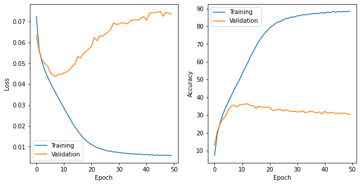
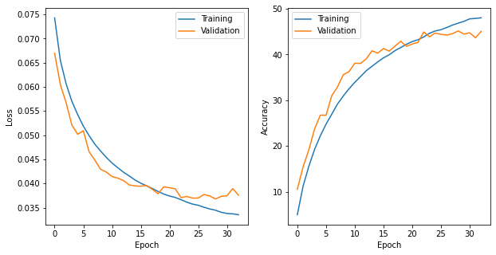
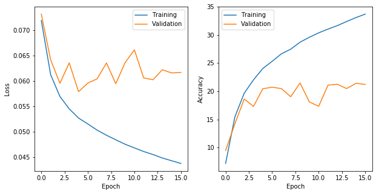
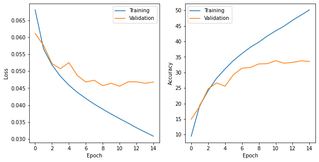
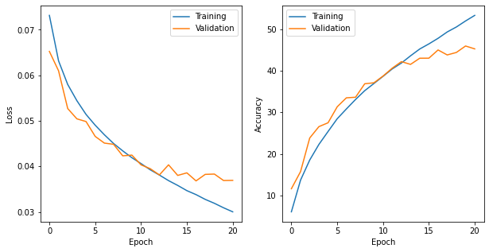

# LAB1

**PB19000196 晏瑞然**

## 内容纲要

- 结果展示及参数解读：
  - 网络参数设定（CNN,RESNET），包括dropout等
  - 学习率与epoch设定
  - 优化器、学习率调整、loss函数设定
  - Transform设定
  - early_stopping方法
- 实验过程记录，记录各种对比结果
  - 网络结构
  - lr
  - 优化器
  - transform对比
  - 有意思的发现(valloss低于trainloss)
- 实验总结

## 最终实验结果

### 网络参数

#### CNN:

| 网络层  | 类型    |   输入    | kernal, stride, padding | 激活函数 |   输出    |
| :-----: | ------- | :-------: | :---------------------: | :------: | :-------: |
|  conv0  | conv    |  3,64,64  |          3,1,1          |   Relu   | 32,64,64  |
|  conv1  | conv    | 32,64,64  |          3,2,1          |   Relu   | 64,32,32  |
|  conv2  | conv    | 64,32,32  |          3,2,1          |   Relu   | 128,16,16 |
|  conv3  | conv    | 128,16,16 |          3,2,1          |   Relu   |  256,8,8  |
|  pool   | pooling |  256,8,8  |          4,4,0          |    -     |  256,2,2  |
| linear1 | linear  | 256\*2\*2 |            -            |   Relu   |    512    |
| linear2 | linear  |    512    |            -            |   Relu   |    200    |

#### Resnet:

| 网络层  | 类型     |   输入    | downsample |   输出    |
| :-----: | -------- | :-------: | :--------: | :-------: |
|  conv0  | conv     |  3,64,64  |     -      | 64,64,64  |
| block1  | reslayer | 64,64,64  |     F      | 64,64,64  |
| block2  | reslayer | 64,32,32  |     T      | 128,32,32 |
| block3  | reslayer | 128,16,16 |     T      | 256,16,16 |
| block4  | reslayer |  256,8,8  |     T      |  512,8,8  |
|  pool   | pooling  |  512,8,8  |     -      |  512,2,2  |
| linear1 | linear   | 512\*2\*2 |     -      |    512    |
| linear2 | linear   |    512    |     -      |    200    |

两个网络都使用dropout(0.15)且所有卷积层后会做BN，激活函数都使用Relu.

residual connection就是简单的通过一个卷积层来让通过block的输出和原始输入维度对齐，block里面用两个3×3的kernel去卷，通过downsample参数控制是否将图片大小降维。

### 其他设定

学习率：初始为0.001

max_epoch: 50(因为设了early stopping)

优化器：`optim.Adam(model.parameters(),lr=lr,weight_decay=1e-4)`，使用adam并带有正则化

学习率调整：递减策略为`scheduler = optim.lr_scheduler.StepLR(optimizer, step_size=10, gamma=0.1)`,没10步乘以0.1。

loss_func: crossentropy

数据增强：`transforms.RandomResizedCrop` & ` transforms.RandomHorizontalFlip`

early stop: True(patience=3)

早停策略是为了自动防止过拟合，如果没设早停策略则需要手动调节max_epoch，否则会出现如下过拟合现象：

### 最终结果

最终准确率为：**45.19%**

Loss&acc曲线:

## 实验记录（对比实验）

### 网络结构对比

注意，此对比中没有使用数据增强策略（但做了归一化），学习率默认为0.001，优化器为adam，学习率递减策略为每10epoch乘0.1。进行了早停策略，patience为3。

#### CNN

如果使用简单的网络(参数如下)：

(64\*64\*3) -> (64\*64\*32)->(22\*22\*64)->(11\*11\*16)->flatten->512->200

最终test准确率为**20.99%**。

loss及acc曲线如下：

可以看出结果并不是很好，主要原因是网络太小了，模型泛化性能不行，但也能看出有拟合的效果。这种简单的网络运行时间也很快，训练一个epoch能在30s以内。

如果采用最终结果的模型参数(见上表格)，最终结果为test_acc=**33.41%**

loss及acc曲线如下：

#### resnet

同样如果使用简单网络，只是用两个block，每次downsample并让通道数翻倍，最终结果test_acc只能达到**25.11%**。

而如果采用得到最终结果的那种复杂resnet（其他参数如优化器与前面一样），最终能达到**38.04%**的test准确率，效果是非常好的，比简单的CNN高了将近1倍，也说明了resnet的优越性。但这也增加了运行时间，每个epoch要跑2min，是最简单的CNN所需时间的4倍。下图是loss及acc曲线：

可以看出resnet效果确实比简单cnn要好（虽然也更耗时），所以之后的实验全部使用上述得到最终结果的resnet网络结构（其他策略可能不同）。

### 数据增强对比

上述结果显然还不够好，接下来实验采用增强策略，主要增强方法是`RandomResizedCrop`和`RandomHorizontalFlip`，风别为随机裁剪和水平翻转。

**注意：原有的代码框架中如果进行增强会使得验证集一起增强，这显然是不合理的，验证集的分布显然不能因为数据增强方法的改变而改变，所以我对代码进行了一些修改，使得增强(即transform1)只作用在训练集上。**

同时，所有实验都对数据进行了归一化，归一化的参数主要来源于对数据集的数据分析，具体分析过程在这就不多赘述了，我也仅仅只是做了提取均值方差等这些基本分析。归一化的参数为：`([0.480, 0.448, 0.398], [0.272, 0.265, 0.274])`前三项是三个通道的均值，后三项为三个通道的方差。其他参数与之前一样。

采用数据增强后test_acc=**45.19%**，loss-acc曲线如下：

从loss&acc曲线中可以看到数据增强能显著提高预测结果，此外，还能发现一些有趣的事情：

**从图中可以看出在前15个左右的epoch验证集效果比训练集还要好，不论是Loss还是acc，验证集的表现都要优于训练集，当发现这件事情的时候我一开始非常恐慌。因为一般出现这种情况都是因为数据泄露问题，经过多次检查发现代码并没有这种错误，网上搜索也没有头绪。最后发现，可能是因为数据增强的原因，数据增强使得训练集变得更加复杂更难拟合，但在拟合这种更加复杂的分布时，对模型的泛化性能也是一种提升。所以在刚开始的时候，验证集的效果反而比训练集好，等到后来，也就是15个epoch之后，验证集loss降低越来越缓慢而training loss仍然下降，并会低于val loss，等到即将过拟合时早停策略使得训练停止。这也是合理的。**

### 优化器对比

我还使用SDG的optimizer进行了实验，SDG参数为`optim.SGD(model.parameters(), lr=0.01,momentum=0.9, weight_decay=1e-4)`，其他策略与上相同（使用了数据增强），最终得到的结果如下：

test准确率：**44.52%**

loss&acc曲线：

可以看出，使用不同优化器对完全拟合后的结果影响并不大。也可能是本次任务比较简单，无法看出不同优化器的不同优越性(比如可能SDG效果更好，adam速度更快等)。至少从本次实验的数据来看，两者差别不大。

### 学习率递减策略对比

之前我们使用`StepLR(optimizer, step_size=10, gamma=0.1)`的策略，接下来我们使用`ExponentialLR(optimizer, gamma=0.9)`进行了实验，该方法表示每个epoch后将学习率乘以gamma即0.9，最终得到的结果与使用stepLR几乎没有区别，test_acc=**44.28%**。loss&acc曲线也与前面的基本相同，在大约30epoch左右停止。

 ## 实验记录汇总表

所有实验结果如下表所示：

| 网络   | 复杂/简单 | 优化器 | 增强                 | 学习率递减    | test acc   |
| ------ | --------- | ------ | -------------------- | ------------- | ---------- |
| CNN    | 简单      | adam   | 只做了归一           | StepLR        | 20.99%     |
| CNN    | 复杂      | adam   | 只做了归一           | StepLR        | 33.41%     |
| ResNet | 简单      | adam   | 只做了归一           | StepLR        | 25.11%     |
| ResNet | 复杂      | adam   | 只做了归一           | StepLR        | 38.04%     |
| ResNet | 复杂      | adam   | 归一、裁剪、水平翻转 | StepLR        | **45.19%** |
| ResNet | 复杂      | SDG    | 归一、裁剪、水平翻转 | StepLR        | 44.52%     |
| ResNet | 复杂      | adam   | 归一、裁剪、水平翻转 | ExponentialLR | 44.28%     |

## 总结

本次实验从头搭建了CNN和ResNet网络(虽然助教写好了框架)，并进行调参在Tiny ImageNet上进行训练与验证。虽然最终结果不是很好只有不到50%，但个人感觉还是挺满意的。

最终效果仍有很大的提升空间。主要是因为本地跑代码受限与计算资源。本实验后面的得到结果的那种相对复杂的网络一个epoch就要2~3分钟(3060笔记本卡)，一次实验就要一个多小时。本人笔记本的垃圾卡根本跑不动(一个epoch30min.....)，只能借别人的电脑跑TAT(不过3060是真的爽)，所以也不敢把网络做的更大。网上也看了很多resnet的结构，基本都是数十层的卷积层。所以本实验效果肯定没这些好，这也没什么办法。

但本次实验也要我感受到了搭建网络和调参的乐趣，一次一次调参让最终结果变得更好也挺有成就感的。总之，本次实验要我收获颇丰，coding能力和调参水平在本次实验中得到了很好的锻练(虽然主要时间都是在调参和等模型training XD)。

