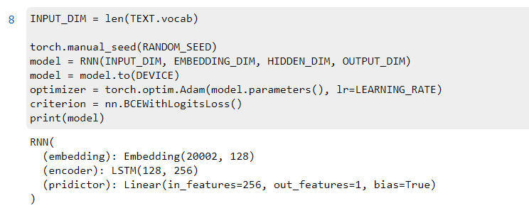

# LAB2

**PB19000196 晏瑞然**

## 目录

- 代码实现细节
  - simpleRNN结构
  - LSTM结构
  - GRU结构
  - 其他设定
  - training&validation&testing
- 层数对比
  - simpleRNN
  - LSTM
  - GRU
  - 结果分析
- 隐藏神经元数量对比
- 实验总结

## 代码细节

### simpleRNN

```python
class RNN(nn.Module):
    def __init__(self, input_dim, embedding_dim, hidden_dim, output_dim):
        super(RNN,self).__init__()
        self.embedding = nn.Embedding(input_dim,embedding_dim)
        self.encoder = nn.RNN(input_size=embedding_dim,
                              hidden_size=hidden_dim,
                              num_layers=1)
        self.pridictor = nn.Linear(hidden_dim,output_dim)
        
    def forward(self, text):
        output, hidden = self.encoder(self.embedding(text))
        preds = self.pridictor(hidden[-1])
        return preds
```

先将输入做embedding，然后通过一个单层的RNN，在RNN输出的最后一个隐藏层h_n(包含前n个隐藏层的所有信息)后接入Linear层进行预测。

### LSTM

```python
class RNN(nn.Module):
    def __init__(self, input_dim, embedding_dim, hidden_dim, output_dim):
        super(RNN,self).__init__()
        self.embedding = nn.Embedding(input_dim,embedding_dim)
        self.encoder = nn.LSTM(input_size=embedding_dim,
                              hidden_size=hidden_dim,
                              num_layers=1)
        self.pridictor = nn.Linear(hidden_dim,output_dim)
        
    def forward(self, text):
        output, (hidden,cell) = self.encoder(self.embedding(text))
        preds = self.pridictor(hidden[-1])
        return preds
```

与上相同，区别就是LSTM的输出会有一个cell，但我们只需要最后一层隐藏层的信息，所以只需简单改一下encoder的输出返回值即可。

### GRU

```python
class RNN(nn.Module):
    def __init__(self, input_dim, embedding_dim, hidden_dim, output_dim):
        super(RNN,self).__init__()
        self.embedding = nn.Embedding(input_dim,embedding_dim)
        self.encoder = nn.GRU(input_size=embedding_dim,
                              hidden_size=hidden_dim,
                              num_layers=1)
        self.pridictor = nn.Linear(hidden_dim,output_dim)
        
    def forward(self, text):
        output, hidden = self.encoder(self.embedding(text))
        preds = self.pridictor(hidden[-1])
        return preds
```

### 其他设定

```python
VOCABULARY_SIZE = 20000
LEARNING_RATE = 1e-4
BATCH_SIZE = 64
NUM_EPOCHS = 15
EMBEDDING_DIM = 128
HIDDEN_DIM = 256
OUTPUT_DIM = 1
optimizer = torch.optim.Adam(model.parameters(), lr=LEARNING_RATE)
criterion = nn.BCEWithLogitsLoss()
```

batchsize设为64(主要是因为128会爆显存......毕竟是本地做的，笔记本显卡太垃圾了......)，EMBEDDING_DIM和HIDDEN_DIM都是后期可改参数，本实验后面也测试了不同HIDDEN_DIM对结果的影响。OUTPUT_DIM = 1直接输出对应二分类的概率，注意输出时是不带sigmoid的，是一个实数域上的值。optimizer就采用简单的Adam，也没有做lr_scheduler，从实验结果可以看出设置lr_scheduler可能会对结果有所提升。critierion采用BCEWithLogitsLoss，这就是简单的二分类logist回归的交叉熵损失函数，这会在输出自带一个sigmoid层所以不必再在网络中通过最后一个sigmoid层。

### training&validation&testing

```python
# training计时
since = time.time()
# training ......
...
# 保存最优模型
	if val_loss<min_val_loss:
        min_val_loss = val_loss
        torch.save(model.state_dict(),path)
        print('model saved!')
...
time_elapsed = time.time() - since
print('\nTraining complete in {:.0f}m {:.0f}s'.format(
    time_elapsed // 60, time_elapsed % 60))


# test acc 计算方法
for idx, batch in enumerate(test_loader):
	outputs = model(inputs).squeeze()
	outputs = torch.sigmoid(outputs)>0.5
    acc+=torch.sum(outputs==labels)
acc /= len(test_data)
```

大多数代码与上次实验相同，但修改了计时方法(直接用time计时而没有用tqdm)，同时没有使用早停机制，只是简单的保存最优的val_loss模型(相当于早停patience = +inf)，最后由于是logist回归，计算acc的方法页略有区别，具体细节如上代码所示。

## 层数对比

进行层数对比时都将hidden_dim值设定为256。

### RNN-1

单层RNN结构如下：


训练15epoch后(保存val_loss最低的模型)，最终测试结果如下：


### RNN-2

2层RNN结构如下：


训练15epoch后(保存val_loss最低的模型)，最终测试结果如下：


### LSTM-1

单层LSTM结构如下：



训练15epoch后(保存val_loss最低的模型)，最终测试结果如下：


### LSTM-2

双层LSTM结构如下：


训练15epoch后(保存val_loss最低的模型)，最终测试结果如下：


### GRU-1

单层GRU结构如下：


训练15epoch后(保存val_loss最低的模型)，最终测试结果如下：


### GRU-2

双层GRU结构如下：


训练15epoch后(保存val_loss最低的模型)，最终测试结果如下：


### 结果分析

对三种模型的单/双层结构(同样参数同样epoch)进行对比，结果表如下：

|            | RNN-1   | RNN-2    | LSTM-1   | LSTM-2   | GRU-1    | GRU-2    |
| ---------- | ------- | -------- | -------- | -------- | -------- | -------- |
| time       | 6min13s | 10min19s | 14min56s | 25min26s | 13min25s | 24min16s |
| 是否欠拟合 | F       | F        | F        | F        | T        | T        |
| test acc   | 65.4%   | 70.9%    | 80.0%    | 79.4%    | 85.6%    | 86.6%    |

是否欠拟合取决于15epoh结束时保存模型时的epoch，如果两个epoch之间差3就认为已经拟合了，RNN和LSTM在15epoch的时候验证集loss已经不会下降了，而GRU-1和GRU-2验证集loss仍有下降的趋势，仍有继续训练提升准确率的空间，也侧面说明了其泛化性能更强，结构也更为复杂。

## 隐藏神经单元对比

由于显存限制(LSTM与GRU都会爆显存)，只进行单层RNN的对比，修改单层RNN的隐藏元数进行比较，结果如下：

|          | RNN-1-128 | RNN-1-256 | RNN-1-512 |
| -------- | --------- | --------- | --------- |
| time     | 4min25s   | 6min13s   | 11min8s   |
| test_acc | 71.2%     | 65.4%     | 62.9%     |

### 结果分析

可以看出隐藏层数越多，训练时间越长，但反而效果更差，这可能是因为RNN本身的性质所导致的，由于没有遗忘机制，更多的隐藏层神经元可能让一些无用的信息被传递，再加上数据集偏小，复杂的模型(隐藏层神经元多的模型)泛化性能反而很差，这就导致了上面的结果出现。

所以有的时候，简单的模型反而更加有效，不仅可以节省时间，还可以得到一个更好的结果。

## 实验总结

本次实验比较了不同RNN模型的不同参数在IMDB数据集 上的结果，得到的最好结果是双层GRU(隐藏层维度256)，在测试集上能有**86.6%**的准确率，而且其并没有经过精确的调参(调lr_scheduler、optimizer等)，能有这个结果已经是相当不错的了，也能看出其优越性。

同时，通过不同模型层数对比以及隐藏层神经元数量对比，我没还可以得知，更复杂的模型并不一定能得到更好的结果，有时候一些简单的模型反而更有效且训练速度也更快。

总之，这次实验让我对循环神经网络模型有了更深刻的认识，让我对其细节以及效果表现有了更深入的了解，从中我收获颇丰。


