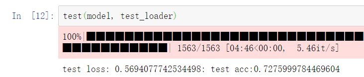

# LAB3

**PB19000196 晏瑞然**

## 目录

- 代码实现细节
  - 预处理
  - load model
  - 其他参数
  - train&test
- 实验结果
  - 结果展示(准确率、时间)
  - 结果对比(效果，时间)
- 实验总结

## 代码细节

### 预处理

整体代码大体与lab2相同，沿用了lab2的tokenizer，但需要有一些修改，一个是得到的文本要固定长度，因为bert的输入文本允许的最大长度为512。在本实验中，用MAX_LEN参数控制句子长度，控制的方法是在data.Field中加上参数`fix_length=MAX_LEN`。同时，MAX_LEN越大，训练效果越好，当然显存占用会变多。本次实验使用本地设备，故显存只有3G，所以将其设为64，想要效果更好可以将该值设的更大。

剩下build_vocab与dataloader部分与LAB2相同。

### Load model

```python
from transformers import BertForSequenceClassification, AdamW, BertConfig

# Load BertForSequenceClassification, the pretrained BERT model with a single
# linear classification layer on top.
model = BertForSequenceClassification.from_pretrained(
    "bert-base-uncased", # Use the 12-layer BERT model, with an uncased vocab.
    num_labels = 2, # The number of output labels--2 for binary classification.
                    # You can increase this for multi-class tasks.
    output_attentions = False, # Whether the model returns attentions weights.
    output_hidden_states = False, # Whether the model returns all hidden-states.
#     mirror='tuna',
)

# Tell pytorch to run this model on the GPU.
model.cuda()
```

load预训练的Bert模型，做法与实验文档中提到的blog的方式向相同。

从输出的打印结果中也可以看出模型的embedding层最大Input_dim=512。句子长度不能超过该值。

### 其他参数

```python
RANDOM_SEED = 123
torch.manual_seed(RANDOM_SEED)

VOCABULARY_SIZE = 20000
LEARNING_RATE = 1e-4
BATCH_SIZE = 16
NUM_EPOCHS = 1
DEVICE = torch.device('cuda' if torch.cuda.is_available() else 'cpu')
print(DEVICE)

PATH = 'best_model.pth' # PATH to save and load model

MAX_LEN=64

optimizer = AdamW(model.parameters(),
                  lr = LEARNING_RATE, # args.learning_rate - default is 5e-5, our notebook had 2e-5
                  eps = 1e-8 # args.adam_epsilon  - default is 1e-8.
                )
criterion = nn.CrossEntropyLoss()
```

batchsize设为64(主要是因为128会爆显存......毕竟是本地做的，笔记本显卡太垃圾了......)，EMBEDDING_DIM和HIDDEN_DIM都是后期可改参数，本实验后面也测试了不同HIDDEN_DIM对结果的影响。OUTPUT_DIM = 1直接输出对应二分类的概率，注意输出时是不带sigmoid的，是一个实数域上的值。optimizer就采用简单的Adam，也没有做lr_scheduler，从实验结果可以看出设置lr_scheduler可能会对结果有所提升。critierion采用BCEWithLogitsLoss，这就是简单的二分类logist回归的交叉熵损失函数，这会在输出自带一个sigmoid层所以不必再在网络中通过最后一个sigmoid层。

### training&validation&testing

```python
def train_val(model,optimizer,criterion,train_loader, valid_loader, epochs, path):
    since = time.time()
    min_val_loss = 1e10
    for epoch in range(epochs):
        train_loss=0.0
        val_loss=0.0
        val_acc = 0.0
        
        # trainning
        model.train()
        print('training...')
        for idx, batch in enumerate(tqdm(train_loader)):
            optimizer.zero_grad()
            inputs, labels=batch.text, batch.label
#             print(inputs[0].size())
            # print(inputs[1].size())
            inputs=inputs[0].transpose(0,1).to(DEVICE)
            labels=labels.to(torch.int64).to(DEVICE)
            outputs = model(inputs,token_type_ids=None,labels=labels)
#             print(labels)
            loss = outputs[0]
            loss.backward()
            optimizer.step()
            train_loss += loss.data.item()
            # print(batch.text[0].size(0))
        train_loss /= len(train_loader)
        # print(len(train_loader))
        print(f"epoch: {epoch+1}: train loss:{train_loss}")
        
        print("valing")
        model.eval()
        with torch.no_grad():
            for val_idx, val_batch in enumerate(tqdm(valid_loader)):
                val_inputs, val_labels=val_batch.text, val_batch.label
                val_inputs = val_inputs[0].transpose(0,1).to(DEVICE)
                val_labels = val_labels.to(torch.int64).to(DEVICE)
                val_outputs =  model(val_inputs,token_type_ids=None)[0]
                val_outputs_acc = torch.argmax(val_outputs,axis=1).view(-1)
                val_acc+=torch.sum(val_outputs_acc==val_labels)
                loss = criterion(val_outputs,val_labels)
                val_loss += loss.data.item()
        val_loss /= len(valid_loader)
        val_acc /= len(valid_data)
        print(f"epoch: {epoch+1}: val loss:{val_loss} val acc:{val_acc}")

        
    time_elapsed = time.time() - since
    print('\nTraining complete in {:.0f}m {:.0f}s'.format(
        time_elapsed // 60, time_elapsed % 60))
    
def test(model, test_loader):
    acc = 0.0
    test_loss = 0.0
    model.eval()
    with torch.no_grad():
        for idx, batch in enumerate(tqdm(test_loader)):
            inputs, labels=batch.text, batch.label
            inputs = inputs[0].transpose(0,1).to(DEVICE)
            labels = labels.to(torch.int64).to(DEVICE)
            outputs = model(inputs,token_type_ids=None)[0]
            loss = criterion(outputs,labels)
            test_loss += loss.data.item()
            outputs = torch.argmax(outputs,axis=1).view(-1)
            acc+=torch.sum(outputs==labels)
    acc /= len(test_data)
    test_loss /= len(test_loader)
    print(f"test loss: {test_loss}: test acc:{acc}")
```

大多数代码与上次实验相同，需要注意bert的输入与输出。bert的输入分为train模式和eval模式，区别是是否传入参数labels。如果传入labels则默认返回一个tuple，第一个位置存放通过交叉熵计算得到的loss，同时要注意输入维度为[batchsize,sentence_len]，这与torch.text得到的句子时不同的，需要在传入时进行一下转置，同时label也要转换数据类型，以符合nn.CrossEntropyLoss的参数数据类型。最后输出取[0]，计算acc与Loss的方式与lab2相同但需要注意这次的输出是[2,n]的，要用CrossEntropyLoss，算acc也要是取argmax而不是直接过sigmoid做logist回归。

## 实验结果

参数如下：

```python
VOCABULARY_SIZE = 20000
LEARNING_RATE = 1e-5
BATCH_SIZE = 16
NUM_EPOCHS = 4
MAX_LEN=64
```

### 最终结果：



### 结果对比

由于显存限制和时间限制，MAX_LEN只设置了64，所以效果有限，最终结果只有**72.76%**的测试集准确率，仅仅略高于RNN的最好效果，但却需要1h左右。效果不好的原因主要是模型太大，却没有足够的资源计算，只是跑一个简单的baseline(4 epochs)，没有也无法做到精细调参（显存太小），否则肯定可以有更好的结果，甚至超过LSTM和GRU。

## 实验总结

本次实验通过bert模型重新对文本情感分类任务进行了处理，让我对bert模型有了更深入的理解。简单的baseline的最终结果有70%以上的准确率，效果可以说是非常不错的。但这种大型模型训练却很不方便，参数过多、训练时间过长都是它的问题所在。所以对于简单的任务，其实完全可以用简单的模型，这样能有更高的效率和不低的准确性。但这次实验也是我第一次跑这种大型模型，也让我有很大的收获。

