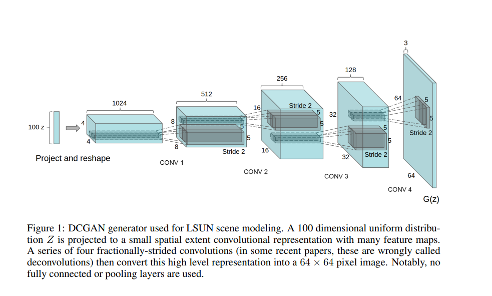
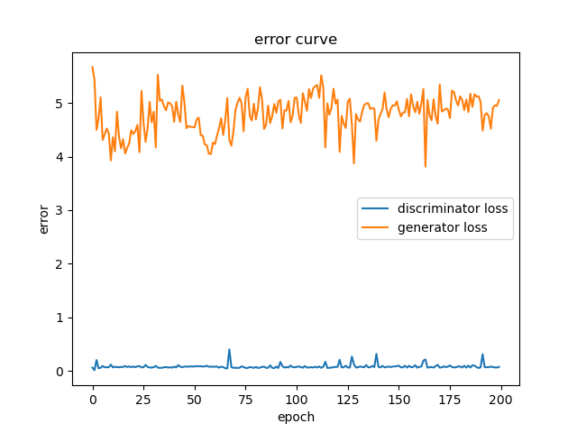

# LAB5

**PB19000196晏瑞然**

## 目录

- 数据说明
- 环境配置
- 提交说明
- 模型说明
- 代码实现细节
  - 网络参数
  - train & test
- 实验结果
  - 迭代结果
  - error曲线

## 数据说明

数据来自知乎用户[何之源](https://links.jianshu.com/go?to=https%3A%2F%2Fwww.zhihu.com%2Fpeople%2Fhe-zhi-yuan-16)爬取并经过处理的图片，共是51223张图片，尺寸是96×96×3，总大小272 MB。

所有数据已上传至睿客云盘，请通过[https://rec.ustc.edu.cn/share/a0efd5b0-f90f-11ec-a6a3-231c05f2c0ca](https://rec.ustc.edu.cn/share/a0efd5b0-f90f-11ec-a6a3-231c05f2c0ca)链接下载数据。

下载后文件存放格式如下：

```
-/
	-GAN.py
	-data/
		-faces/
	-README.md
	-report.md
	-report.pdf
	...
```

即将文件改名为data并放到GAN.py相同文件夹。

## 环境配置

提供requirements.txt文件用于环境配置，里面有所有需要的环境，可使用`conda env create -f requirements.txt`命令直接配置代码运行需要的环境。

## 提交说明

提交如下文件：

`GAN.py`, `README.md`, `report.pdf`, `requirements.txt`, `img/`, `run-video.mp4`

下载数据并配置好环境后可以直接使用`python GAN.py`命令运行代码。img保存了所有的实验数据。mp4文件提供模型跑起来的录屏。

## 模型说明

采用最简单的DCGAN模型（见下图）。



模型参数与DCGAN中的参数基本相同。但需要注意的是，由于数据集尺寸不同（原文图大小为3 \* 64 \* 64，本实验中为3 \* 96 \* 96）所以最后一层的64修改为96，同时因为计算时间的限制，实验中将网络改浅，卷积层深度从(1024, 512, 256, 128)改为(256, 128,  64, 32)。当然，也可以通过修改代码中全局变量gen_fm和dis_fm来修改网络深度，如果有足够的计算资源可以通过修改这两个值为128来实现论文的网络复现。

## 代码实现细节

### 超参设置

```python
# globle para
dir = './data/'
noise_size = 100
gen_fm = 32  # generator feature map
dis_fm = 32  # discriminator feature map
batch_size = 256
d_every = 1  # train discriminator every batch
g_every = 5  # train generator every 5 batch
n_epoch = 200
```

`dir`设置数据路径，`noise_size`根据上图设置为100，`gen_fm`与`dis_fm`对应上图中最后一层卷积网络的feature map数，可以按原文改为128会有更好的效果。`batch_size`原文中是128，这里为了更快的训练设置为256。为了不让discriminator太弱导致生成的图片效果太差，这里每五个batch训练一次generator，而每个batch都训练discriminator来保证discriminator能够很好的判别真假图片（这样误判的图片才更真）。最后`n_epoch`设置要训练的epoch数，设置为200.

### 网络参数

```python
# Generator
class G(nn.Module): 
    def __init__(self, n_input, n_fm):  # n_input:noiseSize n_fm:feature map
        super(G, self).__init__()
        self.generator = nn.Sequential(
            # ConvTranspose2d: h -> (h-1) * stride - 2 * padding + Size
            nn.ConvTranspose2d(n_input, 8 * n_fm, 4, 1, 0),  # 1 -> (1-1)*1+1*(4-1)+0+1=4
            nn.BatchNorm2d(8 * n_fm),
            nn.ReLU(True),  # n_input,1,1 -> 8*n_fm,4,4

            nn.ConvTranspose2d(8 * n_fm, 4 * n_fm, 4, 2, 1),  # 4 -> (4-1)*2-2*1+4=8
            nn.BatchNorm2d(4 * n_fm),
            nn.ReLU(True),  # 8*n_fm,4,4 -> 4*n_fm,8,8

            nn.ConvTranspose2d(4 * n_fm, 2 * n_fm, 4, 2, 1),  # 8 -> (8-1)*2-2*1+4=16
            nn.BatchNorm2d(2 * n_fm),
            nn.ReLU(True),  # 4*n_fm,8,8 -> 2*n_fm,16,16

            nn.ConvTranspose2d(2 * n_fm, n_fm, 4, 2, 1),  # 16 -> (16-1)*2-2*1+4=32
            nn.BatchNorm2d(n_fm),
            nn.ReLU(True),  # 2*n_fm,16,16 -> n_fm,32,32

            nn.ConvTranspose2d(n_fm, 3, 5, 3, 1),  # 32 -> (32-1)*3-2*1+5=96    n_fm,32,32 -> 3,96,96
            nn.Tanh()

        )
        
# Discriminator
class D(nn.Module): 
    def __init__(self, n_fm):
        super(D, self).__init__()
        self.discriminator = nn.Sequential(
            nn.Conv2d(3, n_fm, 5, 3, 1),
            nn.LeakyReLU(0.2, inplace=True),  # n_fm * 32 * 32

            nn.Conv2d(n_fm, 2 * n_fm, 4, 2, 1),
            nn.LeakyReLU(0.2, inplace=True),  # 2*n_fm * 16 * 16

            nn.Conv2d(2 * n_fm, 4 * n_fm, 4, 2, 1),
            nn.LeakyReLU(0.2, inplace=True),  # 4*n_fm * 8 * 8

            nn.Conv2d(4 * n_fm, 8 * n_fm, 4, 2, 1),
            nn.LeakyReLU(0.2, inplace=True),  # 8*n_fm * 4 * 4

            nn.Conv2d(8 * n_fm, 1, 4, 1, 0),  # 1*1*1
            nn.Sigmoid()

        )

```

可以看到网络是相对对称的。同样是根据论文原文提到的，Generator的逆卷积层中加入BN层和ReLU激活函数，最后通过tanh做-1到1的归一。而Discriminator中激活函数采用LeakyReLU，最后通过Sigmoid归一到概率表示置信度。具体卷积层参数可以看`模型说明`中的图示，实验中的网络就是将其深度缩小到原来的1/4进行的实现。

### train & test

#### train

代码如下：

```python
 for epoch in range(1, n_epoch + 1):
        for i, (image, _) in enumerate(tqdm(dataloader)):
            real_image = Variable(image)
            if (i + 1) % d_every == 0:
                optimizer_d.zero_grad()
                output = Discriminator(real_image)
                error_d_real = criterion(output, true_labels)
                error_d_real.backward()
                loss_d += error_d_real.item()
                n_d += 1

                noises.data.copy_(torch.randn(batch_size, noise_size, 1, 1)) # new noise
                fake_img = Generator(noises).detach()  # detach to avoid backward
                fake_output = Discriminator(fake_img) 
                error_d_fake = criterion(fake_output, fake_labels)
                error_d_fake.backward()
                loss_d += error_d_fake.item()
                n_d += 1
                optimizer_d.step()

            if (i + 1) % g_every == 0:
                optimizer_g.zero_grad()
                noises.data.copy_(torch.randn(batch_size, noise_size, 1, 1))
                fake_img = Generator(noises)  # no detach for training generator
                fake_output = Discriminator(fake_img)
                error_g = criterion(fake_output, true_labels)
                error_g.backward()
                loss_g += error_g.item()
                n_g += 1
                optimizer_g.step()
                
        loss_d = loss_d / n_d
        loss_g = loss_g / n_g
        print("epcoh:{}, loss_d:{}, loss_g:{}".format(epoch, loss_d, loss_g))
        loss_d_list.append(loss_d)
        loss_g_list.append(loss_g)
```

这里定义两个优化器分别用于优化Discriminator的参数和Generator的参数，根据前面所说，每`d_every`个epoch训练一次Discriminator每`g_every`个epoch训练一次Generator。

训练Discriminator时除了真实图片，每次还加入一个经过Generator的Noises图片并标上虚假标签（即0）来进行训练，让他有辨别真假图片的能力。因为每次是生成新的noises所以要通过detach进行截断梯度反传，因为这一步里只需要训练Discriminator，并不需要训练Generator，所以通过detach让优化器backward的时候不要计算noise经过Generator的梯度。

而训练Generator时，需要将通过噪声产生的图片经过Discriminator，并要让他接近真实的图片，故让他的标签为`true_labels`（即1），此时就不需要detach进行梯度截断，因为本身就是要更新Generator的参数。

最后记录真实数据（即真图片是1假图片是0）的Discriminator的loss_d和生成的图片能以假乱真（即生成图片被判断成1）的loss_g。

#### test

```python
    # test    
    if epoch % 10 == 0 or epoch == 1:
            fake_imags = Generator(gen_noises)
            fake_imags = fake_imags.data.cpu()[:64] * 0.5 + 0.5  # back norm

            # plt
            fig = plt.figure()
            for i, image in enumerate(fake_imags):
                ax = fig.add_subplot(8, 8, i + 1)
                plt.axis('off')
                plt.imshow(image.permute(1, 2, 0))
            plt.suptitle('epoch=%d' % epoch)
            # plt.show()
            plt.savefig('./img/epoch-{}.png'.format(epoch))
            print("epoch %d result saved" % epoch)

            plt.figure()
            plt.title("error curve")
            plt.xlabel("epoch")
            plt.ylabel("error")
            plt.plot(loss_d_list, label="discriminator loss")
            plt.plot(loss_g_list, label="generator loss")
            plt.legend()

            plt.savefig('./img/epoch-{}-loss.png'.format(epoch))
            print("epoch %d loss saved" % epoch)
```

每10个epoch打印一次生成数据和loss曲线（epoch==1的时候也打印是为了测试方便）。

测试时固定初始的噪声分布，已方便查看训练过程中图片的变化，不然通过不同噪声生成的图片本来就不同，就不方便对比。由于生成过程最后是归一到（-1，1），所以最后还要变成（0，1）的RGB表示，故还进行了一次归一。

最后选取batch中前64张图画成8\*8的子图保存，同时绘制loss_d曲线和loss_g曲线。

### main

```python
if __name__ == '__main__':
    print("data loading...")
    transform = transforms.Compose([
        transforms.Resize(96),
        transforms.CenterCrop(96),
        transforms.ToTensor(),
        transforms.Normalize((0.5, 0.5, 0.5), (0.5, 0.5, 0.5))  # (0,1) -> (-1,1)
    ])

    dataset = torchvision.datasets.ImageFolder(dir, transform=transform)

    dataloader = torch.utils.data.DataLoader(dataset, batch_size=batch_size, shuffle=True, num_workers=1,
                                             drop_last=True)
    print('data loading done')
    Generator = G(noise_size, gen_fm)
    Discriminator = D(dis_fm)

    optimizer_g = torch.optim.Adam(Generator.parameters(), lr=2e-4, betas=(0.5, 0.999))
    optimizer_d = torch.optim.Adam(Discriminator.parameters(), lr=2e-4, betas=(0.5, 0.999))
    criterion = torch.nn.BCELoss()

    TrainAndTest(dataloader, optimizer_d, optimizer_g, Generator, Discriminator, criterion)
```

先加载数据然后初始化模型，注意优化器按照DCGAN的描述选用Adam，lr与betas都选用文中描述的大小，损失函数选用BCELoss这在概率判别中其实与交叉熵等价。

## 实验结果

以下是epoch=10, 20, 50, 100, 150, 200的生成结果展示：


可以看出刚开始训练的图像十分模糊（10~20epoch），但是可以看出图像已经有面部轮廓。

当训练到50个epoch时，生成的图就能看出有头发、眼睛，颜色也变得鲜艳，但是总体还是模糊。

训练100个epoch之后，头发的纹理、眼睛的细节已越来越真实，但还是会有一些涂抹和扭曲的痕迹。

训练150个epoch时，图片相对于100个epoch更加清晰，涂抹和扭曲的痕迹变少了，已经基本可以以假乱真了。

200epcoh时，与150epoch基本相似，可以看出已差不多收敛，里面很多图已经很难人眼看出是自动生成的图片了，例如第二行第四列、第八行第四列的图片，基本与真实的动漫图片相差无几。


以下是200epoch的loss_d与loss_g曲线：



一开始觉得曲线很奇怪，后来查阅一些资料发现并没有什么问题，loss_d一直很低loss_g一直很高并不是模型collapse了，主要是因为我们想要得到更好的以假乱真的图片所以一直在加强discriminator的训练，而generator每5个batch才训练一次，所以相对来说discriminator更强更值得信赖，所以能做到很好的区分真假照片。但这并不影响generator的训练，因为它的训练目标就是得到一个被判定为true label的图片，所以哪怕loss很高，但generator仍然是不断进步的，从生成的图片也可以看出图片越来越真实。所以**并不能通过loss_g不降就判断模型训练失败**。

所有的实验数据保存在img文件夹中一起提交。

## 实验总结

本实验通过DCGAN实现动漫头像的生成，让我对GAN有了更深入的理解并对DCGAN的网络进行了复现。

本实验难度适中，主要难点在网络的搭建和train&test的编写上，同时训练时间很长debug很不方便。弄清楚DCGAN的逆卷积花了挺久的时间，因为之前没有用过ConvTranspose2d所以花了很长时间弄明白它维度是怎么变化的。train&test结构相对简单对称，但也因为训练时间长而不好调试。

本实验一个epoch需要1~2min，主要是需要很多epoch才能有一些效果，所以基本每次都是早上跑晚上看结果，也是几个实验里耗时最久的实验TAT。整体来说除了时间久具体实现起来并不困难的，收获也非常大。
