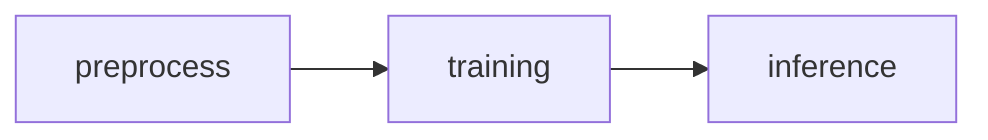
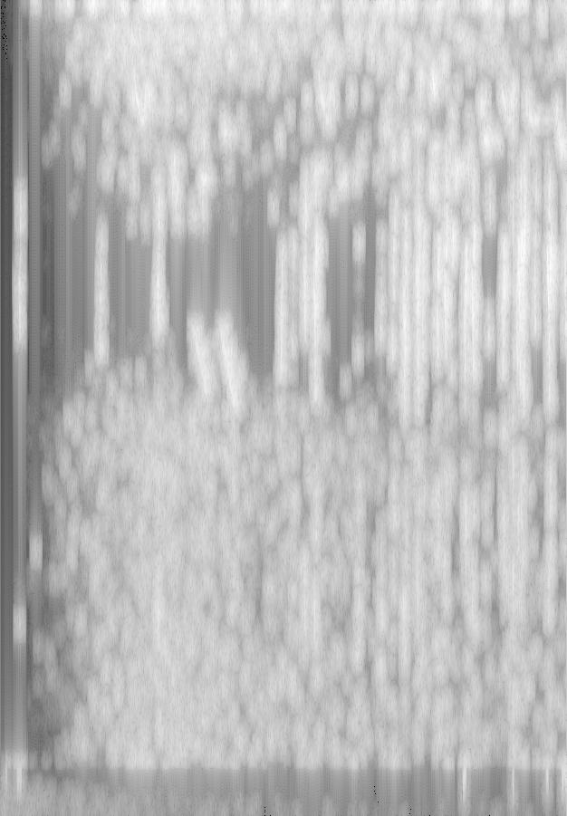
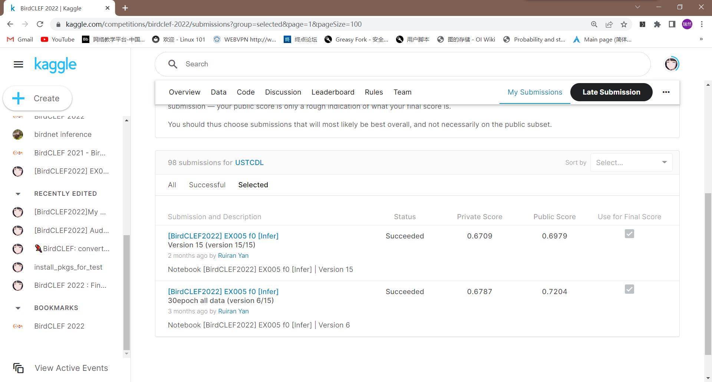

# 深度学习课程竞赛报告

## 比赛名称

[BirdCLEF 2022 | Kaggle](https://www.kaggle.com/competitions/birdclef-2022)

## 比赛简单介绍

比赛任务主要是对鸟类音频进行识别，识别给定音频中是否存在某些鸟类的叫声，以进行濒危鸟类的保护。比赛的数据主要是161种鸟类的叫声，需要得到一个能识别21种鸟类的识别器。数据通过一个表进行索引，表中有音频的file名以及所有的信息(包括label以及2nd label、label可靠度等)。

## 比赛人员及账号

- PB19000233刘子瑞(ziruiliu123)

- PB19000196晏瑞然(Ruiran Yan)

## 项目人员以及贡献

- PB19000233刘子瑞：
  
  - 模型调研：调研各类模型框架并决定使用timm作为整体框架；探索新模型并决定使用resnest、efficientnet作为本比赛的模型。
  
  - 模型训练框架：编写并优化模型训练notebook相关代码以及接口。
  
  - 模型训练与调参：主要对resnest系列模型进行训练与调参工作。

- PB19000196晏瑞然：
  
  - 数据EDA：原始数据分析、音频转换(音频变为melspectrogram)、简单数据预处理(melspectrogram的降噪)。(EDA代码开源到kaggle社区[BirdCLEF2022 EDA 中文 | Kaggle](https://www.kaggle.com/code/ruiranyan/birdclef2022-eda)并获得kaggle notebook铜奖)
  
  - 提交框架：编写并优化模型inference部分并利用训练框架的接口编写提交代码框架。
  
  - 模型训练与调参：主要对efficientnet系列模型进行训练与调参工作。

## 项目流程框架

所有的代码分为三个阶段，分别是**数据处理、模型训练、模型inference**，由于是kaggle比赛，使用kaggle notebook(类似jupyter notebook)对代码进行保存，故每次得到新的结果都是由这三份notebook组成(当然提交只用提交inference的代码，这么做主要是比赛限制了代码运行时间，所以不能把模型训练也一起提交，这这样会超时，只能将模型训练好后来跑inference的代码)。所以需要合理的规划接口，以保证换别的策略时不需要大规模的代码重构。整体流程图如下

## 项目内容

### 数据预处理

主要处理方式是将音频数据转换为梅尔谱图(melspectrogram)通过CV模型进行训练，同时进行降噪处理，参考[1]。梅尔谱图样例如下图：

梅尔谱图主要是将音频分为时域和频域，横坐标是时域，纵坐标时频域，图片某个座标颜色的深浅代表该时间该频率音波振幅的强度，同时它在频率上的刻度不是线性的，而是采用mel scale将其进行一个非线性变化[2]。梅尔谱图也是在音频分类领域一个主流的处理音频的方式。

之后是数据增强的尝试，当我们发现仅仅采用梅尔谱图以及降噪处理并不能得到很好的成绩时，我们发现模型效果差的主要原因是个别训练数据太少，模型无法很好的学好特征，所以需要设计很多数据增强策略，策略主要分为对原始音频的增强以及对转换后的梅尔谱图进行CV层面上的增强。

对原始音频的增强主要入下：

- 对原始音频进行归一、标准化

- 对原始音频加入噪声(Guass noise、pink noise等)

- 对原始音频的音调进行改变

- 对原始音频(已裁剪)进行时间延长，按一定概率比例一部分用0延长(即没有声音)，一部分用随机的声音进行延长。

- 对原始音频volume进行变大变小操作

对梅尔谱图的增强如下：

- 梅尔谱图上进行降噪(对个别频域进行抹除)

- 对梅尔谱图上的音频强度进行截断(音频转换为梅尔谱图后会产生某些频域上音频强度达到数值上无穷的问题)

- 梅尔谱图进行裁剪，填充，旋转，镜像等简单CV操作(后面发现旋转会产生负面效果，镜像和裁剪填充对结果影响也较小)

- 使用mixup(将随机的两张样本按比例混合，分类的结果按比例分配)以及cutmix(将一部分区域cut掉但不填充0像素而是随机填充训练集中的其他数据的区域像素值，分类结果按一定的比例分配)的增强策略

音频的增强方法主要参考了去年BirdCLEF比赛的高名次选手的预处理方式，但因为很多处理方式没有库实现或者库实现的接口与我们代码的接口无法对应，需要进行实现以及重新封装，实现较为麻烦。而对梅尔谱图的处理直接使用pytorch的transform，实现起来比较简单。

数据预处理的代码我们开源到了kaggle上，得到了许多人的评价与称赞，也获得了kaggle notebook铜奖[3]。

### 数据训练

#### 模型选择

数据训练采用名为timm的pytorch的视觉模型库，该库主要是对目前主流模型pytorch实现的封装，用户能直接通过create_model直接得到pretrain以后的sota模型，而不需要从头开始搭建。timm也是目前流行的深度学习框架，在各种比赛中都被广泛应用。

具体的模型使用经过调研初步定为renest系列模型以及efficientnet系列模型。我们分别对这两种模型进行了实验以及调参，最终提交结果主要采用efficientnet_b0_ns模型(但实际上两个模型效果差不多，泛化性能都很强，时间开销也都很大)，对efficientnet_b0_ns模型进行finetune后作为比赛的模型进行训练。

具体对模型的finetune如下：

- efficientnet_b0_ns的最后一层线性层去掉只得到图片的feature map，将其作为模型的encoder

- 对得到的featrue map在时域上求平均，表征整个图片的feature

- 通过一个avg_pool以及Max_pool层增强泛化性能

- 最后通过一个attention block得到最终logit

#### 评价指标设计

这个比赛一个最有趣的地方是它没有公开评价指标，只是说会用类似macro F1_score的评价指标。

> Submissions are evaluated on a metric that is most similar to the [macro F1 score](https://en.wikipedia.org/wiki/F-score)

但实际上macro F1 score的效果并不理想，根据一些开源的代码，最终采用micro f1 score[4](这也是去年BirdCLEF比赛的公开评价指标[5])作为验证集的评价指标实现早停策略。

#### 损失函数的选择

本次比赛最大的trick就是损失函数这里，这里我们刚开始时使用最常见的Cross Entropy的损失函数，效果非常的差。为此，我们咨询了连老师，连老师给我们的提议是根据提交需求选择损失函数。

因为结果评价是对每一类进行True or False的判断，而不是根据featrue map判断标签，简单说就是一段音频中可能会存在多种鸟的叫声。我们需要找到所有的鸟，而不是判断这是哪一种鸟，而训练数据中只有一种鸟，所以如果只用cross entropy损失函数，再通过一个阈值选取鸟，会出现一定的偏差。

最终我们在连老师的建议下选用了加权BCEloss，仅仅是这一个损失函数的不同结果分数能达到将近0.1，可以说是非常巨大的提升，这也是比赛中最重要的trick。

### 结果提交

提交结果的格式上面以及讲过了，给定一段音频，对要求的21种鸟判断这种鸟的叫声是否存在于这段音频种。

我们单独使用一个notebook来进行这部分代码的编写，同样有一些trick，最重要的是设计对logit的阈值设置，即logit达到多少时判断有这种鸟类，根据一些提交进行测试，发现评价指标(虽然并未公布)对负样例更有偏向，即你False填的多一些会得到更高的分数，相应阈值应该设的很小，所以我们最终采用0.045的阈值，相比与传统0.5的阈值，也能高0.1左右的成绩(采用0.5基本只能在全False和全True的结果上提升一点点，效果很差)。

## 最终结果

最终排名：

- 公榜：195/802

- 私榜：322/802

最终排名并不是很理想，私榜成绩比公榜成绩差很多，比赛后我们也很沮丧，并认真分析了失败的原因：

- 这个比赛太卷了。比赛前几名很多都是鸟类专家，甚至一些相关产业公司的专业数据分析师，他们对这一领域有比我们更深刻的认识。同时BirdCLEF比赛已经举办了很多届了，2022比赛参加的选手有大量参加过以前比赛的选手，他们在之前的比赛积攒了大量的经验并准备了很多音频数据做数据增强，而我们只是小白刚踏入这一领域。但即便如此，在比赛的前期，我们仍拿到了30/500+的好名次，不过后面被人赶超。

- 计算资源不够。本次比赛需要非常庞大的网络，本次使用的efficientnet b0网络有5330564个参数(未算后期finetune的参数)，这导致1个epoch的训练就要1个小时左右。而我们只能白嫖kaggle的免费GPU(华为云10多块钱一个小时根本顶不住)，而kaggle的GPU每周只能白嫖38小时左右(有的周甚至只有30小时)，这是远远不够的，很多想法都不能得到及时的验证，实验的次数也不够多，没法得到更好的模型。而要想拿到很好的成绩，榜单前几名基本都做了模型融合，这需要大量的计算资源，我们根本没法完成。

- 个人认为本比赛有数据泄露的问题。赛后的总结中有人提出他们使用BirdNet模型(如本次比赛第一名)，这个模型就是赛事主办方自己训练的一个模型，有人搜索到了赛事主办方的github仓库并找到了这个模型，直接使用这个模型进行训练。而这个模型本来就是专门用来进行鸟声识别的，用2000+种鸟类的大量样本训练出来的(包括本次比赛要识别的21种鸟)，这种网络的效果自然比我们efficientnet网络做finetune要好得多。有人也在赛后质疑了主办方，主办方答复是"规则中有写出可以使用开源模型，BirdNet的训练数据中也没有测试集数据，所以使用BirdNet不违规"。而事实是有人说自己只是使用了这个模型，甚至没使用其他任何Trick得到的分数就能得到银牌。BirdNet的发现主要是比赛进入到后期选手发现的，而当时我们已经接近期末并有大量实验ddl，所以对比赛关注度降低了很多，只是感觉后期突然排名大幅下降，整体分数也大幅上涨，现在看来也跟这个有关。

- 我们很多优化都导致了过拟合。可以看出我们公/私榜的排名差距很大，个人认为是因为我们对Public数据过拟合了，我们有些成绩公榜分数更低私榜分数反而很高(有的成绩甚至有私榜前100，但可惜没有提交)，可能是我们数据增强做的还不够好，但我们主要是因为时间问题为了让模型更快收敛只把增强的概率设为0.1~0.3，所以是用大量的原始数据训练的，可能这导致了public数据的过拟合。

- 评价指标问题。我们至今不知道本次比赛的评价指标是什么，而这种评价指标导致大家的分数都非常的接近，0.001的差距可能都是几十名，但模型又非常的敏感，随便调一下参都会导致0.01以上的偏差，也很难分析处具体原因，我们与前100也就只有0.01的差距。最重要的是公榜在公布私榜前只保留2位小数，我们同样0.72的成绩一份是0.7245一份是0.7204，我们只提交了0.7204的成绩，而另一份0.7245的成绩却能在私榜排前100，我们却没有提交，非常可惜。

## 比赛总结

本次比赛算是我们第一次如此投入的参加一次数据比赛，也非常感谢kaggle能提供这样的一个平台以及计算资源供我们学习使用。

总的来说从本次比赛中还是学会了很多，也是第一次从头到尾全栈式解决一个项目问题，而不是完成以及实现好框架并处理好数据的课程实验。比赛让我们的coding能力大大增强并让我们注意到了许多真正工程问题求解中的问题，如怎么处理脏数据，怎么定义合作的接口。因为涉及到合作，所以有许多代码规范问题，你得保证你写的部分你的同伴能看得懂并能使用你的接口，这都是不可多得的经验。非常感谢这门课能给我们这次机会学到这么多东西，这些都是简单的课程实验中所学不到的。

也希望以后能有更多的机会参加这种比赛，让自己的能力得到更多的锻练。

## 参考链接

[1] [birdclef-convert-spectrograms-noise-reduce](https://www.kaggle.com/code/jirkaborovec/birdclef-convert-spectrograms-noise-reduce)

[2] [梅尔频谱(mel spectrogram)原理与使用](https://zhuanlan.zhihu.com/p/351956040)

[3][BirdCLEF2022 EDA 中文 | Kaggle](https://www.kaggle.com/code/ruiranyan/birdclef2022-eda)

[4] [Macro-F1 Score与Micro-F1 Score](https://zhuanlan.zhihu.com/p/64315175)

[5] [BirdCLEF 2021 - Birdcall Identification | Kaggle](https://www.kaggle.com/c/birdclef-2021)
